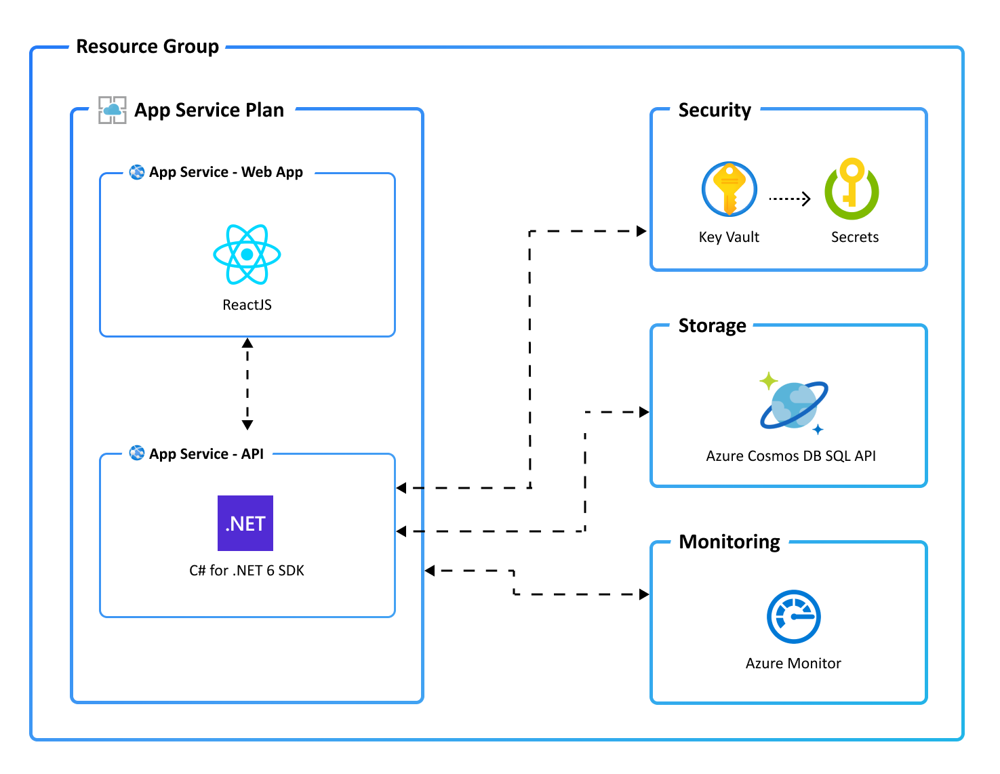

# Trey Järjestöportaali

A modern web application for managing organizations, surveys, and user authentication.

## Features

### Authentication and User Management
- Custom identity and access management system
- JWT-based authentication
- Role-based access control (Admin, User roles)
- Email verification system
- Password reset functionality
- Session management with automatic timeout
- User profile management

### Organization Management
- Create and manage organizations
- Assign users to organizations
- Organization-specific settings and permissions

### Survey System
- Create and manage surveys
- Collect and analyze survey responses
- Survey templates and customization
- Response tracking and reporting

### File Management
- Secure file upload and storage
- File organization and categorization
- Access control for files
- File versioning

## Technical Stack

### Backend
- .NET 8
- Azure Cosmos DB for data storage
- Azure Blob Storage for file storage
- JWT for authentication
- SMTP for email services

### Frontend
- React with TypeScript
- Material-UI for components
- React Router for navigation
- Context API for state management

## Getting Started

### Prerequisites
- .NET 8 SDK
- Node.js 18 or later
- Azure subscription (for cloud deployment)
- SMTP server for email functionality

### Environment Variables

#### Backend (.NET)
```
AZURE_COSMOS_DATABASE_NAME=your_database_name
AZURE_COSMOS_ENDPOINT=your_cosmos_endpoint
AZURE_STORAGE_CONNECTION_STRING=your_storage_connection_string
JWT_SECRET=your_jwt_secret
JWT_ISSUER=your_jwt_issuer
JWT_AUDIENCE=your_jwt_audience
SMTP_SERVER=your_smtp_server
SMTP_PORT=587
SMTP_USERNAME=your_smtp_username
SMTP_PASSWORD=your_smtp_password
SMTP_FROM_EMAIL=your_from_email
WEB_URI=your_web_application_uri
```

#### Frontend (React)
```
REACT_APP_API_URL=your_api_url
```

### Installation

1. Clone the repository:
```bash
git clone https://github.com/your-username/trey-jarjestoportaali.git
cd trey-jarjestoportaali
```

2. Install backend dependencies:
```bash
cd src/api
dotnet restore
```

3. Install frontend dependencies:
```bash
cd ../web
npm install
```

4. Start the development servers:

Backend:
```bash
cd ../api
dotnet run
```

Frontend:
```bash
cd ../web
npm start
```

## Email Verification System

The application includes a comprehensive email verification system:

1. **Registration Process**
   - Users receive a verification email upon registration
   - Email contains a secure verification link
   - Users must verify their email before logging in

2. **Verification Flow**
   - Click verification link in email
   - System validates the token
   - User account is marked as verified
   - User can now log in

3. **Resend Verification**
   - Users can request a new verification email
   - Available from the login page if email is unverified
   - New verification token is generated

4. **Admin Features**
   - View email verification status in user management
   - Monitor unverified accounts
   - Track verification rates

## Security Features

- JWT-based authentication with secure token generation
- Password hashing using SHA-256
- Email verification for new accounts
- Session timeout after 7 days of inactivity
- Warning notification 5 minutes before session expiry
- Role-based access control
- Secure password reset flow
- Protection against common security vulnerabilities

## Contributing

1. Fork the repository
2. Create your feature branch (`git checkout -b feature/amazing-feature`)
3. Commit your changes (`git commit -m 'Add some amazing feature'`)
4. Push to the branch (`git push origin feature/amazing-feature`)
5. Open a Pull Request

## License

This project is licensed under the MIT License - see the LICENSE file for details.

## Support

For support, please contact [support@example.com](mailto:support@example.com)

[![Sponsored](https://img.shields.io/badge/chilicorn-sponsored-brightgreen.svg?logo=data%3Aimage%2Fpng%3Bbase64%2CiVBORw0KGgoAAAANSUhEUgAAAA4AAAAPCAMAAADjyg5GAAABqlBMVEUAAAAzmTM3pEn%2FSTGhVSY4ZD43STdOXk5lSGAyhz41iz8xkz2HUCWFFhTFFRUzZDvbIB00Zzoyfj9zlHY0ZzmMfY0ydT0zjj92l3qjeR3dNSkoZp4ykEAzjT8ylUBlgj0yiT0ymECkwKjWqAyjuqcghpUykD%2BUQCKoQyAHb%2BgylkAyl0EynkEzmkA0mUA3mj86oUg7oUo8n0k%2FS%2Bw%2Fo0xBnE5BpU9Br0ZKo1ZLmFZOjEhesGljuzllqW50tH14aS14qm17mX9%2Bx4GAgUCEx02JySqOvpSXvI%2BYvp2orqmpzeGrQh%2Bsr6yssa2ttK6v0bKxMBy01bm4zLu5yry7yb29x77BzMPCxsLEzMXFxsXGx8fI3PLJ08vKysrKy8rL2s3MzczOH8LR0dHW19bX19fZ2dna2trc3Nzd3d3d3t3f39%2FgtZTg4ODi4uLj4%2BPlGxLl5eXm5ubnRzPn5%2Bfo6Ojp6enqfmzq6urr6%2Bvt7e3t7u3uDwvugwbu7u7v6Obv8fDz8%2FP09PT2igP29vb4%2BPj6y376%2Bu%2F7%2Bfv9%2Ff39%2Fv3%2BkAH%2FAwf%2FtwD%2F9wCyh1KfAAAAKXRSTlMABQ4VGykqLjVCTVNgdXuHj5Kaq62vt77ExNPX2%2Bju8vX6%2Bvr7%2FP7%2B%2FiiUMfUAAADTSURBVAjXBcFRTsIwHAfgX%2FtvOyjdYDUsRkFjTIwkPvjiOTyX9%2FAIJt7BF570BopEdHOOstHS%2BX0s439RGwnfuB5gSFOZAgDqjQOBivtGkCc7j%2B2e8XNzefWSu%2BsZUD1QfoTq0y6mZsUSvIkRoGYnHu6Yc63pDCjiSNE2kYLdCUAWVmK4zsxzO%2BQQFxNs5b479NHXopkbWX9U3PAwWAVSY%2FpZf1udQ7rfUpQ1CzurDPpwo16Ff2cMWjuFHX9qCV0Y0Ok4Jvh63IABUNnktl%2B6sgP%2BARIxSrT%2FMhLlAAAAAElFTkSuQmCC)](http://spiceprogram.org/oss-sponsorship)

Monorepo for the new Järjestöportaali for TREY, a successor of Tahlo.

### Prerequisites

The following prerequisites are required to use this application. Please ensure that you have them all installed locally.

- [Azure Developer CLI](https://aka.ms/azd-install)
- [.NET SDK 8.0](https://dotnet.microsoft.com/download/dotnet/8.0) - for the API backend
- [Node.js with npm (18.17.1+)](https://nodejs.org/) - for the Web frontend

### Quickstart

This quickstart will show you how to authenticate on Azure, provision infrastructure and deploy code on Azure via the following commands:

```bash
# Log in to azd. Only required once per-install.
azd auth login

# Provision and deploy to Azure
azd up
```

### Application Architecture

This application utilizes the following Azure resources:

- [**Azure App Services**](https://docs.microsoft.com/azure/app-service/) to host the Web frontend and API backend
- [**Azure Cosmos DB for NoSQL**](https://docs.microsoft.com/learn/modules/intro-to-azure-cosmos-db-core-api/) for storage
- [**Azure Monitor**](https://docs.microsoft.com/azure/azure-monitor/) for monitoring and logging
- [**Azure Key Vault**](https://docs.microsoft.com/azure/key-vault/) for securing secrets

Here's a high level architecture diagram that illustrates these components. Notice that these are all contained within a single [resource group](https://docs.microsoft.com/azure/azure-resource-manager/management/manage-resource-groups-portal), that will be created for you when you create the resources.



### Cost of provisioning and deploying this template
This template provisions resources to an Azure subscription that you will select upon provisioning them. Refer to the [Pricing calculator for Microsoft Azure](https://azure.microsoft.com/pricing/calculator/) to estimate the cost you might incur when this template is running on Azure and, if needed, update the included Azure resource definitions found in `infra/main.bicep` to suit your needs.

### Application Code

This template is structured to follow the [Azure Developer CLI](https://aka.ms/azure-dev/overview). You can learn more about `azd` architecture in [the official documentation](https://learn.microsoft.com/azure/developer/azure-developer-cli/make-azd-compatible?pivots=azd-create#understand-the-azd-architecture).

### Next Steps

At this point, you have a complete application deployed on Azure. But there is much more that the Azure Developer CLI can do. These next steps will introduce you to additional commands that will make creating applications on Azure much easier. Using the Azure Developer CLI, you can setup your pipelines, monitor your application, test and debug locally.

> Note: Needs to manually install [setup-azd extension](https://marketplace.visualstudio.com/items?itemName=ms-azuretools.azd) for Azure DevOps (azdo).

- [`azd pipeline config`](https://learn.microsoft.com/azure/developer/azure-developer-cli/configure-devops-pipeline?tabs=GitHub) - to configure a CI/CD pipeline (using GitHub Actions or Azure DevOps) to deploy your application whenever code is pushed to the main branch.

- [`azd monitor`](https://learn.microsoft.com/azure/developer/azure-developer-cli/monitor-your-app) - to monitor the application and quickly navigate to the various Application Insights dashboards (e.g. overview, live metrics, logs)

- [Run and Debug Locally](https://learn.microsoft.com/azure/developer/azure-developer-cli/debug?pivots=ide-vs-code) - using Visual Studio Code and the Azure Developer CLI extension

- [`azd down`](https://learn.microsoft.com/azure/developer/azure-developer-cli/reference#azd-down) - to delete all the Azure resources created with this template

### Additional `azd` commands

The Azure Developer CLI includes many other commands to help with your Azure development experience. You can view these commands at the terminal by running `azd help`. You can also view the full list of commands on our [Azure Developer CLI command](https://aka.ms/azure-dev/ref) page.


## Security

### Roles

This template creates a [managed identity](https://docs.microsoft.com/azure/active-directory/managed-identities-azure-resources/overview) for your app inside your Azure Active Directory tenant, and it is used to authenticate your app with Azure and other services that support Azure AD authentication like Key Vault via access policies. You will see principalId referenced in the infrastructure as code files, that refers to the id of the currently logged in Azure Developer CLI user, which will be granted access policies and permissions to run the application locally. To view your managed identity in the Azure Portal, follow these [steps](https://docs.microsoft.com/azure/active-directory/managed-identities-azure-resources/how-to-view-managed-identity-service-principal-portal).

### Key Vault

This template uses [Azure Key Vault](https://docs.microsoft.com/azure/key-vault/general/overview) to securely store your Cosmos DB connection string for the provisioned Cosmos DB account. Key Vault is a cloud service for securely storing and accessing secrets (API keys, passwords, certificates, cryptographic keys) and makes it simple to give other Azure services access to them. As you continue developing your solution, you may add as many secrets to your Key Vault as you require.
